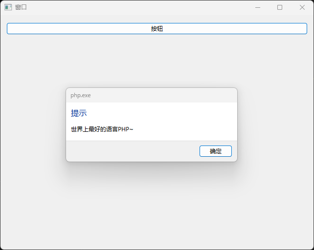

# php-libui

⭐ PHP-FFI 绑定 libui，实现跨平台 GUI 编程。

目前 `libui` 库版本不再更新,但功能强大,

所以我将该库称之为 🔥(`珍藏版`)🔥

文档后续会持续更新,欢迎star,issue,pr~

## 依赖

- PHP 8.2+
- PHP-FFI 扩展

## 平台

- Windows Vista SP2 平台更新或更高版本 x86_64
- macOS OS X 10.8 或更高版本 x86_64
- Linux GTK+ 3.10 或更高版本 x86_64

## 安装

```bash
composer require kingbes/libui
```

## 示例

```php
<?php

require dirname(__DIR__) . "/vendor/autoload.php";

use Kingbes\Libui\App; // 应用
use Kingbes\Libui\Window; // 窗口
use Kingbes\Libui\Control; // 控件
use Kingbes\Libui\Box; // 容器
use Kingbes\Libui\Button; // 按钮

// 初始化应用
App::init();
// 创建窗口
$window = Window::create("窗口", 640, 480, 0);
// 创建控件
$control = new Control();
// 窗口设置边框
Window::setMargined($window, true);
// 窗口关闭事件
Window::onClosing($window, function ($window) {
    echo "窗口关闭";
    // 退出应用
    App::quit();
    // 返回1：奏效,返回0：不奏效
    return 1;
});

// 创建水平容器
$box = Box::newVerticalBox();
Box::setPadded($box, true); // 设置边距
Window::setChild($window, $box); // 设置窗口子元素
// 创建按钮
$btn01 = Button::create("按钮");
// 追加按钮到容器
Box::append($box, $btn01, false);
// 按钮点击事件
Button::onClicked($btn01, function ($btn01) use ($window) {
    echo "按钮点击\n";
    Window::msgBox($window, "提示", "世界上最好的语言PHP~");
});

// 显示控件
Control::show($window);
// 主循环
App::main();

```


